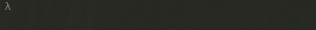
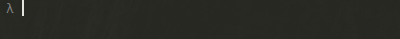

# ina-cli
Cli application for checking if a desired name is registered on npm.

The checking functionality is in an other package called __ina__.

# Install

```bash
npm install ina-cli -g
```

# Usage

```bash
ina name-of-your-desired-package
```
Note: you can write as many names as you want

Not taken:



Taken with details:


# Options

* -v, --version
* -l, --list
* -r, --recheck
* -s, --save
* -d, --detailed

# Additional usage info

Using __-s__ will save the available names in a file under __YOUR_HOME_DIRECTORY/.ina/packages.json__

You can use __-l__ to list the saved files and __-r__ to recheck if the names got registered meanwhile
